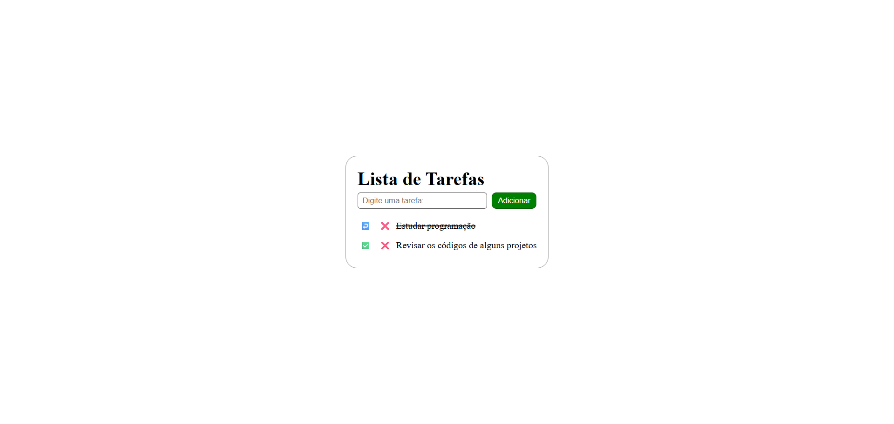

# ✅ Lista de Tarefas

Aplicação simples de **to-do list** feita com **HTML, CSS e JavaScript puro (vanilla)**, sem uso de frameworks ou bibliotecas. O projeto foi desenvolvido para praticar manipulação do DOM, arrays de objetos e persistência de dados no navegador com `localStorage`.

## 📸 Demonstração



## ✨ Funcionalidades

- Adicionar novas tarefas
- Marcar/desmarcar tarefa como concluída (com texto riscado)
- Remover tarefas da lista
- Validação simples para não permitir adicionar tarefa vazia
- **Persistência de dados**: as tarefas ficam salvas no `localStorage`, então continuam lá mesmo depois de fechar ou recarregar a página

## 🛠️ Tecnologias utilizadas

- **HTML5**
- **CSS3**
- **JavaScript** (manipulação de DOM e `localStorage`, sem frameworks)

## 🚀 Como executar o projeto

Por ser um projeto simples de HTML/CSS/JS, não há dependências para instalar. Basta:

1. Clonar o repositório
   ```bash
   git clone https://github.com/seu-usuario/nome-do-repositorio.git
   ```
2. Abrir o arquivo `index.html` no navegador

   Ou, se estiver usando o VS Code, recomenda-se abrir com a extensão **Live Server** para melhor experiência de desenvolvimento.

## 📂 Estrutura do projeto

```
├── index.html      # Estrutura da página
├── style.css       # Estilização
└── scripts.js      # Lógica da lista de tarefas
```

## 🧠 O que foi praticado neste projeto

- Manipulação de arrays de objetos em JavaScript
- Persistência de dados no navegador com `localStorage` (`getItem`, `setItem`, `JSON.parse`/`JSON.stringify`)
- Atualização dinâmica do DOM sem recarregar a página
- Uso de índices para editar/remover itens específicos de uma lista (`splice`)

## 🔧 Possíveis melhorias futuras

- Edição do texto de uma tarefa já criada
- Filtros (todas / pendentes / concluídas)
- Reordenar tarefas (drag and drop)
- Migrar o armazenamento para um back-end (ex: API + banco de dados)

## 👤 Autor

Desenvolvido por **Lucas Sousa** — [seu portfólio](https://lucasdesenvolvedorweb.com.br) | [LinkedIn](https://linkedin.com/in/lucas-batista-sousa)

---

Projeto desenvolvido para fins de estudo e portfólio.